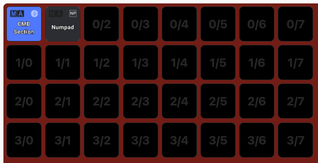
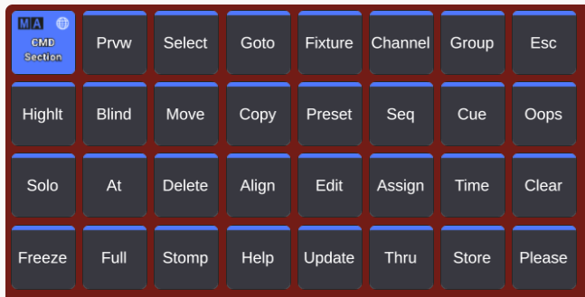
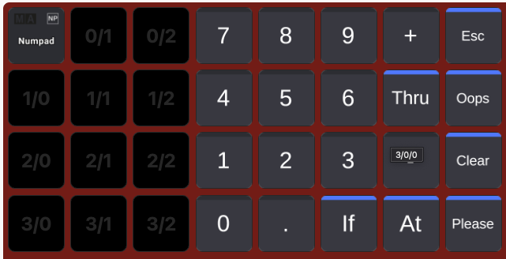

## What software do I need to build my own grandMA3 onPC system?

To build your own grandMA3 onPC system, you need the following software:

| Software Name      | Download Link                                                       |
|--------------------|---------------------------------------------------------------------|
| grandMA3 onPC      | [Download](https://www.malighting.com/downloads/products/grandma3/) |
| Chataigne          | [Download](https://benjamin.kuperberg.fr/chataigne/)                |
| Bitfocus Companion | [Download](https://bitfocus.io/companion/)                          |

After downloading the software, you can start installing it on your computer. When finished, you can start configuring the software to your needs:

## Configuring Chataigne
Download this [repository](https://github.com/einlichtvogel/grandMA3-Feedback-Chataigne-Module/) and put it into your Chataigne 'modules' folder. The default location is:
- Windows: `C:\Users\<Username>\Documents\Chataigne\modules`
- Mac: `/Users/<Username>/Documents/Chataigne/modules`

Then:
1. Open Chataigne
2. Load the File 'APC_TO_MA3.noisette' from the 'software/chataigne' folder in this repository
3. Click on 'APC Mini mkII' on the left 'Modules' section
4. Select your MIDI Input and Output on the right 'Inspector -> Parameters -> Devices' section (Do this for both, if you have two APCs)
5. Click on 'File -> Save' in the top left corner

Chataigne uses following ports:

| Port | Usage                          |
|------|--------------------------------|
| 8080 | Send OSC to MA                 |
| 8093 | Receive OSC from MA (Feedback) |

This software needs to run as long as you want to sync your Akai to GrandMA3.

The button layout for the left AKAI:

And for the right AKAI:

## Configuring Bitfocus Companion
1. Download the Companion config file '[GrandMA3_OSC_QK_Names_and_Numpad_v2.companionconfig](companion/GrandMA3_OSC_QK_Names_and_Numpad_v2.companionconfig)' from the 'software/companion' folder in this repository
2. Open the Web Interface of Bitfocus Companion
3. Click on 'Import / Export' in the top selection bar
4. Click on 'Import' and select the file from above.
5. Configure either your Stream Deck (XL) or your web simulator to use the buttons

Companion uses following ports:

| Port | Usage          |
|------|----------------|
| 8081 | Send OSC to MA |

If you wanna use the numpad, you need to additionally download the [Vicreo Listener](https://vicreo-listener.com/) and link it to Companion.
In this file you get a preconfigured Command Wing layout and a Numpad layout with all the Quickeys needed to control grandMA3 onPC. You can of course modify this file to your needs. Here are some pictures:

## Configuring grandMA3 onPC
1. Open grandMA3 onPC and load your showfile
2. Copy the "grandMA3_OSC_Feedback_3.0.0.3" folder from the previously downloaded repository (grandMA3-Feedback-Chataigne-Module) and the "grandma3/QuickeyCreator" folder to "C:\ProgramData\MALightingTechnology\gma3_library\datapools\plugins"
3. Open your Plugin Pool, create a new plugin, and click import below. Do this for both files.

4. Run the "Command Wing Quickey Creator" Plugin. This will create all the Quickeys and OSC Outputs needed for the OSC commands from Companion.
5. Run the "grandMA3 OSC Feedback" Plugin. This need's to run as long as you want to sync your Akai to GrandMA3.

Please check that under "Setup -> In/Out -> OSC" "Enable Input" and "Enable Output" for OSC is enabled.

Done! You have successfully configured your software to build your own grandMA3 onPC system. If you have any questions, feel free to open an issue in this repository.

Finally, I think this is a good place to shout a special thanks to a couple of people:
- [Benjamin Kuperberg](https://benjamin.kuperberg.fr/chataigne/) for creating Chataigne
- [Bitfocus](https://bitfocus.io/companion/) for creating Companion
- [xxpasixx](https://github.com/xxpasixx/pam-osc) for creating the original pam-osc Plugin for grandMA3 which I edited for the usage of this project
- scriptix from the Stage223 Discord for inspiring me with this project